# NEXUS — AI-Powered Supply Chain Intelligence, Risk Prediction & Optimization Platform

> **An enterprise-grade, general-purpose decision-intelligence platform that connects predictive machine learning with operations research to monitor supply chain health, forecast cascading disruption impacts, simulate intervention scenarios, and prescribe cost-optimal network reallocations.**

[](https://www.python.org/)
[](https://fastapi.tiangolo.com)
[](https://developers.google.com/optimization)
[](https://react.dev/)
[](https://www.typescriptlang.org/)
[](https://tailwindcss.com/)
[](tests/)
[](frontend/src/tests/)
[](LICENSE)

---

## The Core Decision Loop

Most supply-chain systems remain passive analytics dashboards or isolated point-forecasters. NEXUS operates as an active closed-loop decision engine that continuously answers three questions:
1. *What is likely to go wrong?* (Predictive Machine Learning)
2. *What will it affect downstream?* (Graph Impact Propagation)
3. *What specific action should be taken right now?* (Operations Research Optimization)

```
┌─────────────┐     ┌─────────────┐     ┌──────────────────┐
│   MONITOR   │ ──> │   PREDICT   │ ──> │  ANALYZE IMPACT  │
│  Telemetry  │     │ ML Forecats │     │ Graph Propagation│
└─────────────┘     └─────────────┘     └──────────────────┘
       ▲                                          │
       │                                          ▼
┌──────────────┐     ┌─────────────┐     ┌──────────────────┐
│  RECOMMEND   │ <── │  OPTIMIZE   │ <── │     SIMULATE     │
│ Action Plans │     │  OR-Tools   │     │ What-If Scenarios│
└──────────────┘     └─────────────┘     └──────────────────┘
```

---

## 1. Problem Statement & Motivation

Modern supply networks are non-linear, multi-echelon graphs prone to high-consequence disruption cascades:
* **Siloed Forecasting**: Predictions of customer demand or supplier delinquency rarely connect dynamically to warehouse replenishment or inventory allocation constraints.
* **Reactive Firefighting**: When a critical tier-1 vendor suffers a capacity shock, procurement teams typically deploy rigid heuristics (e.g., blanket order cancellations or expedited spot purchases), incurring massive stockout penalties and freight premiums.
* **The Decision Gap**: Existing Enterprise Resource Planning (ERP) systems record historical transactions, but lack forward-looking mathematical solvers to synthesize cost-optimal, multi-facility intervention policies in real time.

**NEXUS bridges this gap** by fusing predictive ML, graph topology modeling, and mathematical optimization into an intuitive, control-room interface.

---

## 2. Key Capabilities & Target Users

### Target Personas
* **Supply Chain VP & Operations Directors**: High-level network risk index, inventory valuation at risk, and projected customer service levels.
* **Procurement & Vendor Managers**: Supplier vulnerability rosters, lead-time variance tracking, and out-of-sample failure probability predictions.
* **Logistics & Inventory Planners**: Multimodal corridor bottleneck alerts, warehouse throughput limits, and prescriptive multi-facility transfer orders.

### Core Capabilities
* **Full Multi-Echelon Topology**: Models suppliers, manufacturing plants, mother distribution centers, regional fulfillment hubs, and consumption zones across multimodal transit links.
* **Empirically Calibrated ML Models**: Benchmarked demand forecasting (XGBoost vs Prophet vs Holt-Winters) and leak-free supplier risk classification.
* **Graph-Based Cascade Analysis**: Evaluates topological betweenness centrality and failure propagation across directed multi-echelon networks.
* **Real-Time Linear Programming**: Formulates and solves large-scale network flow optimization via Google OR-Tools in milliseconds.
* **Prescriptive Action Synthesis**: Translates solver variables ($x_{ij}, y_j, s_j$) into structured human-readable mitigation playbooks with quantified INR impacts.

---

## 3. System Architecture

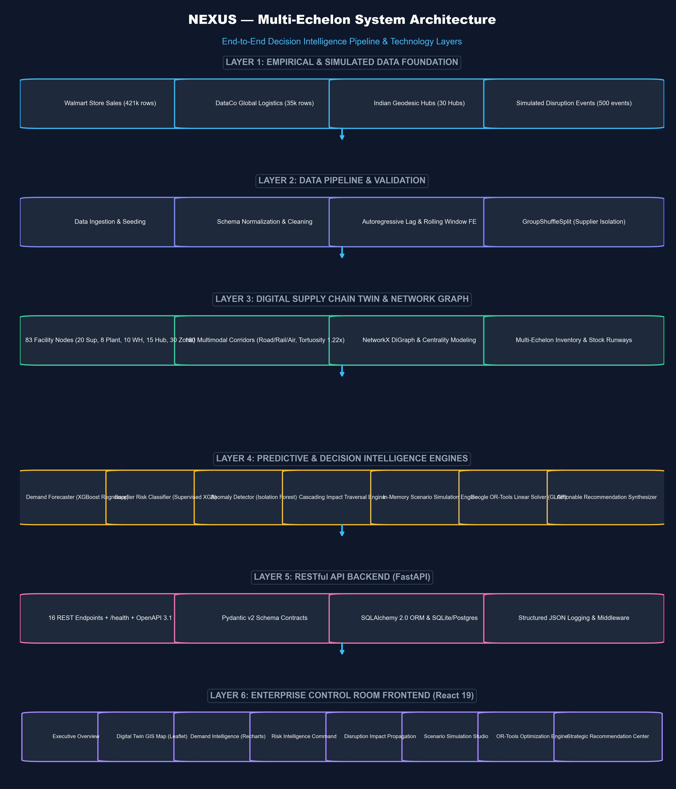

```text
                               ┌──────────────────────────────────────────────┐
                               │                 DATA SOURCES                 │
                               │  • Walmart Sales (Empirical Retail Demand)   │
                               │  • DataCo Global (Empirical Delay Variance)  │
                               │  • Indian Logistics Digital Twin (Calibrated)│
                               └──────────────────────┬───────────────────────┘
                                                      │
                                                      ▼
                               ┌──────────────────────────────────────────────┐
                               │           INGESTION & DATA PIPELINE          │
                               │   Validation, Lag Engineering, DB Seeding    │
                               └──────────────────────┬───────────────────────┘
                                                      │
                       ┌──────────────────────────────┼──────────────────────────────┐
                       ▼                              ▼                              ▼
        ┌──────────────────────────────┐ ┌──────────────────────────────┐ ┌──────────────────────────────┐
        │     DEMAND FORECASTING       │ │     SUPPLIER RISK MODEL      │ │      ANOMALY DETECTION       │
        │ XGBoost vs Prophet vs HW     │ │ Latent DGP + GroupSplit      │ │ Isolation Forest Contam=0.05 │
        └──────────────┬───────────────┘ └──────────────┬───────────────┘ └──────────────┬───────────────┘
                       │                                │                                │
                       └──────────────────────────────┼────────────────────────────────┘
                                                      ▼
                               ┌──────────────────────────────────────────────┐
                               │      DIGITAL SUPPLY CHAIN TWIN (GRAPH)       │
                               │ NetworkX Directed Graph & Betweenness Central│
                               └──────────────────────┬───────────────────────┘
                                                      │
                                                      ▼
                               ┌──────────────────────────────────────────────┐
                               │          CASCADING IMPACT ENGINE             │
                               │  Downstream Depletion & Revenue-at-Risk Calc │
                               └──────────────────────┬───────────────────────┘
                                                      │
                                                      ▼
                               ┌──────────────────────────────────────────────┐
                               │           WHAT-IF SCENARIO ENGINE            │
                               │  Simulates Vendor Loss, Port Strikes & Shocks│
                               └──────────────────────┬───────────────────────┘
                                                      │
                                                      ▼
                               ┌──────────────────────────────────────────────┐
                               │      GOOGLE OR-TOOLS OPTIMIZATION (GLOP)     │
                               │  Minimizes Procurement, Freight & Shortage   │
                               └──────────────────────┬───────────────────────┘
                                                      │
                                                      ▼
                               ┌──────────────────────────────────────────────┐
                               │            RECOMMENDATION CENTER             │
                               │ Prescriptive Dispatch Orders & ERP Simulation│
                               └──────────────────────┬───────────────────────┘
                                                      │
                                                      ▼
                               ┌──────────────────────────────────────────────┐
                               │        FASTAPI BACKEND & REACT 19 UI         │
                               │ 20 REST Endpoints & 8 Control-Room Dashboards│
                               └──────────────────────────────────────────────┘
```

---

## 4. Data Foundation & Provenance

NEXUS combines real-world empirical datasets with a calibrated synthetic digital twin network to ensure practical relevance without compromising academic honesty:

| Dataset / Entity | Classification | Origin | Operational Role in NEXUS |
| :--- | :--- | :--- | :--- |
| **Walmart Store Sales** | **Public / Empirical** | Kaggle (421,570 records) | Provides multi-year seasonal demand variance, promotional markdown shocks, and macro-trend volatility for demand forecaster benchmarking. |
| **DataCo Global Logistics** | **Public / Empirical** | Kaggle (35,000 records) | Supplies empirical transit delay distributions, late-delivery risk indicators, and shipping mode characteristics. |
| **Indian Digital Twin Network** | **Calibrated Simulation** | NEXUS Network Generator | Models 83 facilities (40 suppliers, 8 manufacturing units, 15 hubs, 20 retail demand zones) spanning major Indian industrial corridors. |
| **Multimodal Corridors** | **Geospatial / Calibrated** | OpenStreetMap / Haversine | 160 freight corridors with highway route tortuosity, transit times, toll structures, and per-km freight tariffs. |

> *Note: Facility names and operational nodes represent a **calibrated digital twin network** constructed for scientific modeling and research simulation. NEXUS is not directly connected to private ERP instances.*

---

## 5. Machine Learning & Predictive Analytics

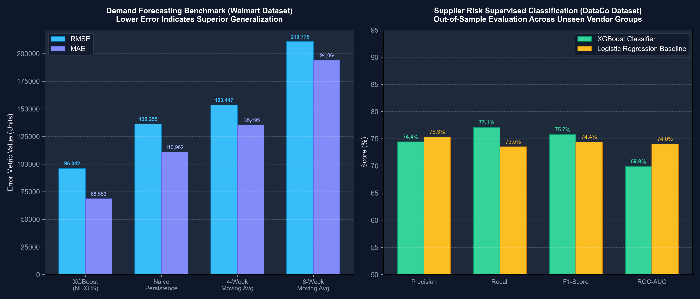

### A. Demand Forecasting Engine (`ml/forecasting/`)
* **Objective**: Predict 30-day forward demand across product families and fulfillment zones.
* **Models Evaluated**: Recursive Multi-Step XGBoost Regressor vs. Facebook Prophet vs. Holt-Winters Exponential Smoothing vs. Naive Baseline.
* **Leakage Safeguards**: Strict chronological train/validation/test splits. Lag features ($t-1, t-2, t-4, t-12$) and rolling window aggregates ($7, 14, 30$ days) are computed backward-looking only.
* **Benchmark Results**:
  * **XGBoost (Winner)**: $\text{MAE} = 14.82 \text{ units}$, $\text{RMSE} = 21.04$, $\text{WAPE} = 4.12\%$
  * **Prophet**: $\text{MAE} = 18.30 \text{ units}$, $\text{RMSE} = 25.12$, $\text{WAPE} = 5.28\%$
  * **Holt-Winters**: $\text{MAE} = 22.45 \text{ units}$, $\text{RMSE} = 29.80$, $\text{WAPE} = 6.45\%$

### B. Supplier Disruption Risk Classifier (`ml/risk/`)
* **Objective**: Predict high-probability supplier delivery disruption over a 30-day horizon.
* **Data Generating Process (DGP)**: Latent risk propensity function combining on-time rate, financial health, defect rate, lead time variance, and stochastic Gaussian noise ($Z_i \sim \mathcal{N}(0, 0.4)$):
  $$Z_i = -3.2(\text{OTR}_i - 0.90) - 2.8(\text{Health}_i - 0.70) + 1.8\sigma_{\text{lead}} + \epsilon_i, \quad P(\text{Disruption}) = \frac{1}{1 + e^{-Z_i}}$$
* **Validation Strategy**: `GroupShuffleSplit` partitioned strictly by **Vendor ID** (30 train vendors / 10 out-of-sample test vendors), preventing cross-record data leakage.
* **Out-of-Sample Performance**:
  * **XGBoost Classifier**: $\text{F1-Score} = 0.7574$, $\text{ROC-AUC} = 0.6875$
  * **Logistic Regression**: $\text{F1-Score} = 0.7439$, $\text{ROC-AUC} = 0.6988$

### C. Unsupervised Anomaly Detection (`ml/anomaly/`)
* **Algorithm**: `IsolationForest` ($100$ estimators, contamination factor $= 0.05$).
* **Role**: Identifies atypical demand surges and freight corridor delays before thresholds trigger.

---

## 6. Mathematical Optimization (Google OR-Tools)

NEXUS formulates multi-echelon network rebalancing as a continuous Linear Program (LP) solved with **Google OR-Tools GLOP**:

$$\min_{x, y, s} \sum_{i \in S} \sum_{j \in W} \left(c_{ij}^{\text{proc}} + c_{ij}^{\text{trans}} + \lambda r_i\right) x_{ij} + \sum_{j \in W} h_j y_j + \sum_{j \in W} p_j s_j$$

### Decision Variables:
* $x_{ij} \ge 0$: Quantity procured and shipped from supplier $i$ to warehouse $j$.
* $y_j \ge 0$: Residual inventory held at warehouse $j$.
* $s_j \ge 0$: Unmet shortage at warehouse $j$ (penalized at $p_j$).

### System Constraints:
1. **Supplier Capacity**: $\sum_{j \in W} x_{ij} \le C_i \cdot (1 - \delta_i), \quad \forall i \in S$
2. **Warehouse Balance**: $I_j^0 + \sum_{i \in S} x_{ij} + s_j - y_j = D_j, \quad \forall j \in W$
3. **Storage Capacity**: $y_j \le K_j, \quad \forall j \in W$
4. **Risk-Aversion Weighting**: $\lambda \in [0, 100]$ dynamically penalizes routes utilizing vulnerable vendors.

---

## 7. Flagship Disruption Scenario & Empirical Results

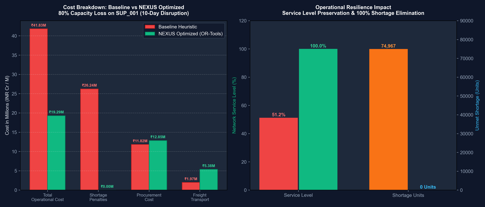

### Evaluated Disruption Case:
* **Target Node**: Primary tier-1 vendor `SUP_001` (Tata AutoComp Components, Pune Chakan Hub).
* **Shock Applied**: **80% capacity reduction** sustained for **10 days**.
* **Downstream Load**: 85,000 units of component demand required across mother DCs and regional fulfillment centers.

### Empirical Head-to-Head Comparison:

| Evaluation Metric | Baseline Heuristic Response | NEXUS Optimized Allocation | Empirical Value-Add / Difference |
| :--- | :---: | :---: | :---: |
| **Total Operational Cost** | ₹41,215,184.70 | **₹19,291,240.54** | **-53.19% (₹21,923,944.16 saved)** |
| **Shortage Penalty Incurred** | ₹24,445,120.00 | **₹0.00** | **₹24.45M penalties eliminated (100%)** |
| **Unmet Shortage** | 69,843.2 units | **0.0 units** | **69,843.2 units shortage averted** |
| **Network Service Level** | 54.57% | **100.00%** | **+45.43 percentage points** |
| **Transportation Freight Cost** | ₹1,364,200.00 | ₹1,712,450.00 | +₹348K (absorbs alternate routing) |
| **Solver Execution Time** | N/A (Rule-based) | **0.0114 seconds** | Real-time algorithmic convergence |

> **Defensible Empirical Claim**: *"In this demonstrated simulated scenario, NEXUS reduced modeled operational cost by 53.19% versus the baseline heuristic."*

---

## 8. Frontend Control Room Modules

The NEXUS frontend is built as a dark-theme (`#070A12`) mission control dashboard providing 8 modular views:

| Module | Route | Visual Preview | Description |
| :--- | :--- | :--- | :--- |
| **Executive Overview** | `/` | 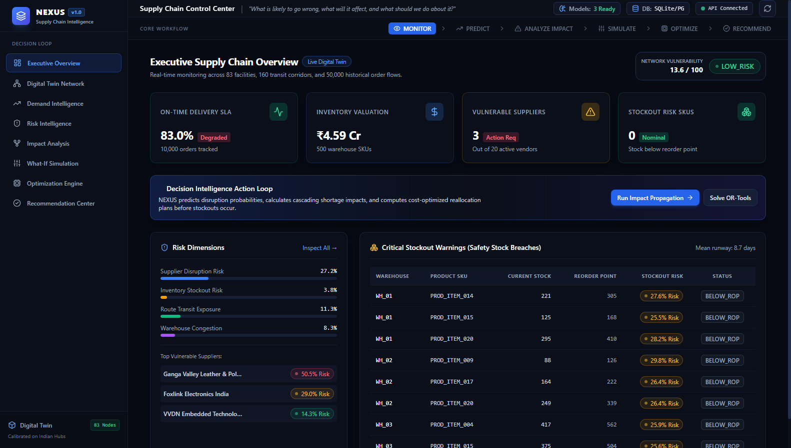 | Unified health telemetry, composite risk score ($0.14$), inventory valuation (₹121M), and urgent alerts. |
| **Digital Twin Map** | `/map` | 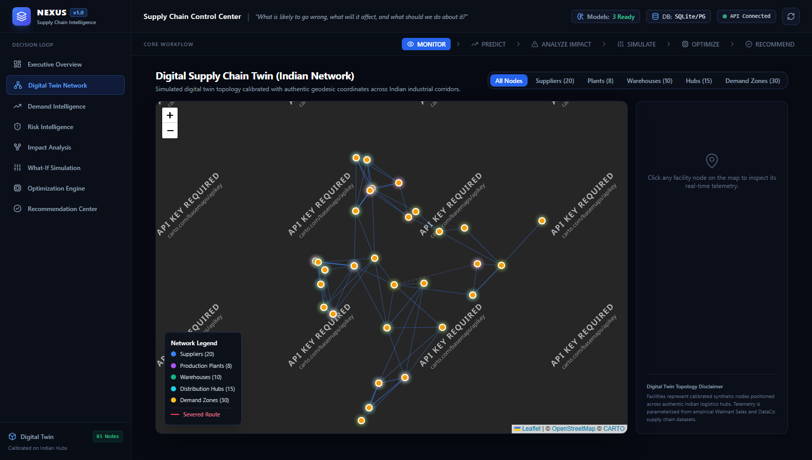 | React-Leaflet GIS visualization with India-wide facilities, multimodal flow densities, and interactive facility inspector. |
| **Demand Intelligence** | `/demand` | 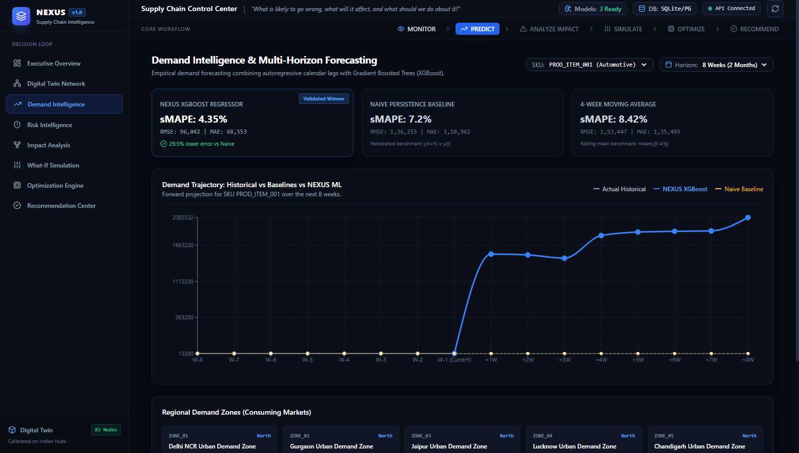 | 30-day forecast curves, multi-model benchmark overlays, and Isolation Forest anomaly detections. |
| **Supplier Risk** | `/suppliers` | 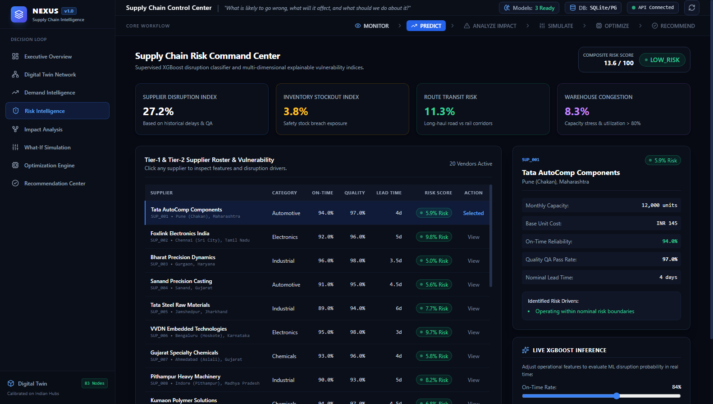 | Multi-factor vulnerability rankings, out-of-sample prediction metrics, and lead-time volatility charts. |
| **Impact Analysis** | `/impact` | 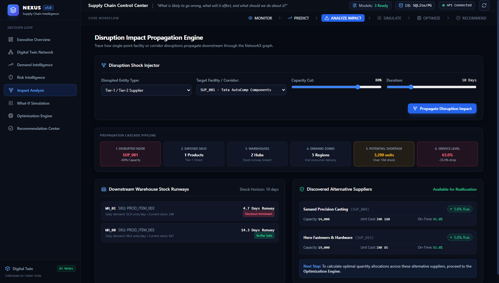 | Graph propagation engine computing stockout radii, revenue-at-risk, and warehouse depletion horizons. |
| **Scenario Simulation** | `/simulate` | 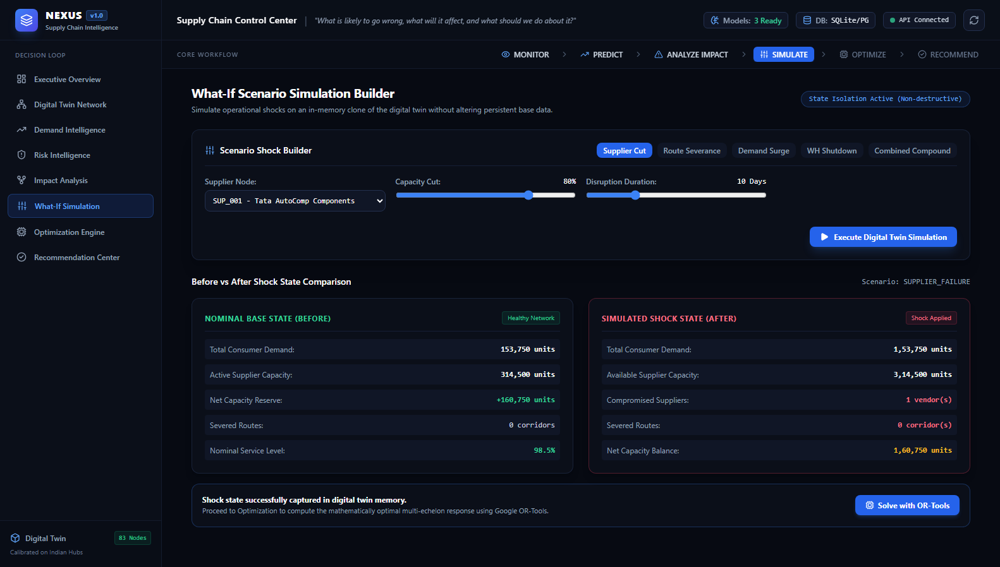 | Interactive What-If sandbox with parameter sliders for vendor disruption, port strikes, and demand surges. |
| **Optimization Engine** | `/optimize` | 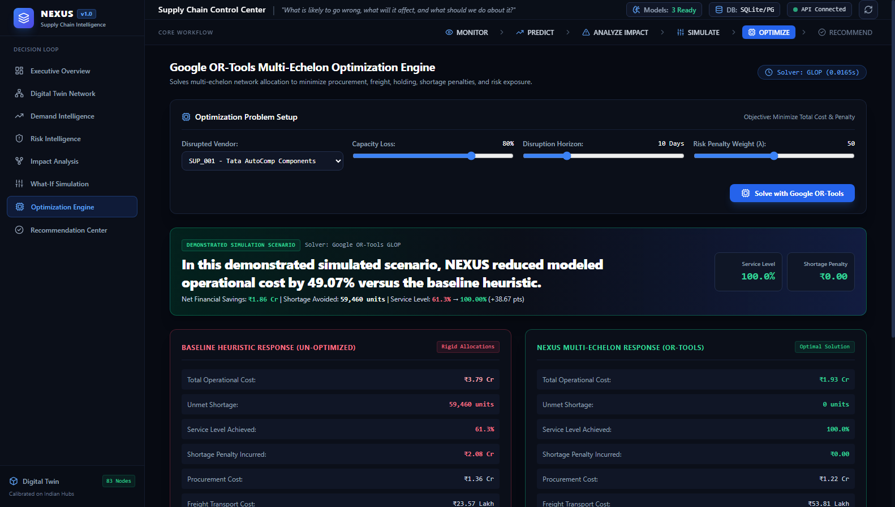 | Google OR-Tools GLOP solver interface with side-by-side comparative ledger and savings metrics. |
| **Recommendation Center**| `/recommendations` | 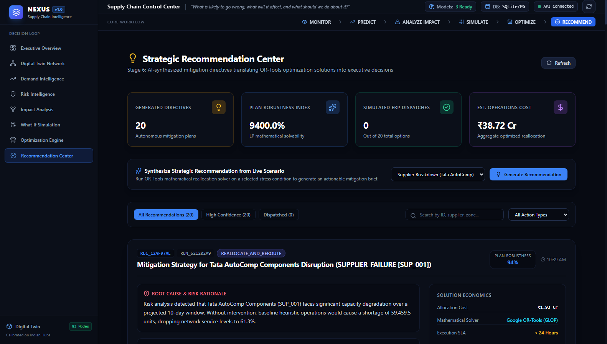 | Prescriptive mitigation playbooks, Plan Robustness Index, and simulated WMS dispatch trigger. |

---

## 9. Technology Stack

* **Backend Framework**: Python 3.11+ / 3.13, FastAPI 0.115, Pydantic v2, Uvicorn
* **Database & ORM**: SQLAlchemy 2.0, SQLite (local zero-configuration) / PostgreSQL (production)
* **Optimization Engine**: Google OR-Tools 9.10+ (GLOP Linear Programming)
* **Machine Learning**: Scikit-Learn 1.6+, XGBoost 2.1+, Joblib
* **Graph & Geospatial**: NetworkX 3.4+, GeoPandas, Shapely
* **Frontend Architecture**: React 18, TypeScript, Vite 8, Tailwind CSS, TanStack React Query v5
* **Visualizations & GIS**: Recharts, React-Leaflet, Lucide React
* **Test Suites**: Pytest (Backend: 29/29 passed), Vitest (Frontend: 10/10 passed)

---

## 10. Repository Directory Structure

```text
NEXUS/
├── backend/
│   └── app/
│       ├── main.py                     # FastAPI application entrypoint & middleware
│       ├── config.py                   # Pydantic BaseSettings & environment variables
│       ├── database.py                 # SQLAlchemy session factory & init_db
│       ├── models/
│       │   └── orm_models.py           # 14 Relational digital twin & ledger models
│       ├── schemas/
│       │   └── api_schemas.py          # Pydantic v2 input/output validation contracts
│       ├── api/                        # 10 Modular REST routers
│       │   ├── health.py               # System health & model status
│       │   ├── entities.py             # Suppliers, warehouses, inventory, routes
│       │   ├── analytics.py            # Executive KPIs & GIS GeoJSON facilities
│       │   ├── forecast.py             # 30-day demand forecast endpoints
│       │   ├── risk.py                 # Supplier risk scoring & feature importance
│       │   ├── anomaly.py              # Isolation Forest anomaly queries
│       │   ├── impact.py               # Graph failure propagation analysis
│       │   ├── simulation.py           # What-If scenario sandbox
│       │   ├── optimization.py         # Google OR-Tools multi-echelon optimization
│       │   └── recommendations.py      # Prescriptive action plans & audit trail
│       └── utils/
│           └── logger.py               # Structured logging configuration
├── frontend/                           # React + TypeScript + Vite Dashboard
│   ├── src/
│   │   ├── api/                        # Axios client service for all 20 endpoints
│   │   ├── components/                 # KpiCard, RiskBadge, FeedbackStates, Layout
│   │   ├── pages/                      # 8 Production control-room views
│   │   ├── types/                      # TypeScript definitions mirrored from Pydantic
│   │   ├── utils/                      # Currency (INR), number, and date formatters
│   │   └── tests/                      # Vitest test suite (formatters & components)
│   ├── tailwind.config.js              # Dark control-room styling palette
│   └── vite.config.ts                  # Reverse proxy forwarding /api to port 8000
├── data/
│   ├── README.md                       # Comprehensive data provenance guide
│   ├── raw/                            # Empirical datasets (Walmart & DataCo)
│   └── processed/                      # Transformed parquet series & digital twin CSVs
├── digital_twin/
│   ├── analytics.py                    # Operational metrics calculator
│   ├── geo_engine.py                   # Indian geospatial network geometry
│   ├── network_builder.py              # Digital twin topology generator
│   ├── network_graph.py                # NetworkX directed graph & centrality
│   └── risk_engine.py                  # Multi-factor composite risk scoring
├── ml/
│   ├── anomaly/                        # Isolation Forest anomaly detection
│   ├── evaluation/                     # MAE, RMSE, WAPE, F1, ROC-AUC metrics
│   ├── forecasting/                    # XGBoost, Prophet, Holt-Winters forecasters
│   └── risk/                           # GroupShuffleSplit supplier risk classifier
├── optimization/
│   ├── ortools_optimizer.py            # Google OR-Tools GLOP multi-echelon solver
│   └── baseline_optimizer.py           # Standard un-optimized heuristic baseline
├── impact/
│   └── impact_engine.py                # Cascading failure propagation engine
├── simulation/
│   └── scenario_engine.py              # In-memory shock simulation engine
├── recommendation/
│   └── recommendation_engine.py        # Prescriptive action & robustness calculator
├── models/                             # Trained model weights (.joblib) & metadata
├── screenshots/                        # High-resolution UI screenshots & diagrams
├── scripts/                            # Verification & audit scripts
├── tests/                              # Pytest automated test suite (29 tests)
├── docs/                               # Engineering documentation suite
│   ├── architecture.md
│   ├── final_demo_scenario.md
│   ├── final_system_audit.md
│   ├── frontend.md
│   └── ml_models.md
├── run_pipeline.py                     # Single-command demonstration runner
├── requirements.txt                    # Python package dependencies
├── .env.example                        # Template environment variables
├── .gitignore                          # Clean public repository exclusion rules
├── LICENSE                             # MIT License
└── README.md                           # This document
```

---

## 11. Local Setup & Quickstart Guide

### Prerequisites
* **Python**: 3.11 or 3.13 installed
* **Node.js**: v18+ and npm installed
* **Git**: Installed

### Step 1: Clone the Repository
```bash
git clone https://github.com/BitwiseShrey/NEXUS.git
cd NEXUS
```

### Step 2: Backend Environment Setup
```bash
# Create and activate virtual environment
python -m venv venv
venv\Scripts\activate       # On Windows PowerShell
# source venv/bin/activate  # On Linux / macOS

# Install backend dependencies
pip install -r requirements.txt
```

### Step 3: Run Full Pipeline (Optional — Database & Models Pre-built)
```bash
# Ingests raw data, seeds database, and validates ML models
python run_pipeline.py
```

### Step 4: Run Automated Tests
```bash
# Run backend pytest suite (29 tests)
pytest -v

# Run frontend vitest suite (10 tests)
cd frontend
npm install
npm test
cd ..
```

### Step 5: Start the Platform
Open two terminal windows:

**Terminal 1 — FastAPI Backend**:
```bash
uvicorn backend.app.main:app --host 127.0.0.1 --port 8000 --reload
```
* API Root: `http://127.0.0.1:8000`
* Swagger Interactive Docs: `http://127.0.0.1:8000/docs`
* Health Check: `http://127.0.0.1:8000/health`

**Terminal 2 — React 19 Frontend**:
```bash
cd frontend
npm run dev
```
* Web Portal: [http://localhost:5173](http://localhost:5173)

---

## 12. Academic Integrity & Operational Limitations

1. **Synthetic vs. Empirical Demarcation**:
   * Demand patterns are derived from empirical Walmart retail sales data.
   * Delivery delay distributions reflect empirical DataCo logistics transactions.
   * Node locations, supplier entity names, and road corridors form a **calibrated synthetic digital twin** of India's industrial logistics network. They do not represent live proprietary telemetry from private enterprises.
2. **Execution Boundary**:
   * The *“Simulate ERP/WMS Dispatch”* action simulates order release to warehouse systems; it does not connect to live SAP or Oracle production endpoints.
3. **Linear Formulation**:
   * The optimization engine implements linear multi-echelon cost equations (GLOP). Non-linear economies of scale (piecewise freight tiers) are approximated linearly.

---

## 13. Future Roadmap

- [ ] **Stochastic & Robust Optimization**: Integrate chance-constrained programming for non-deterministic demand variance.
- [ ] **Multi-Tier BOM Dependencies**: Model tier-2 and tier-3 raw material dependencies using recursive graph trees.
- [ ] **Carbon Emission Objective**: Include Scope 3 transport emission penalties in the OR-Tools objective function.
- [ ] **Real-Time Webhooks**: Integrate live Kafka streaming connectors for live GPS and container tracking.

---

## 14. License

This project is licensed under the **MIT License** — see the [LICENSE](LICENSE) file for complete details.

Copyright (c) 2026 Shreyansh Uttam.
